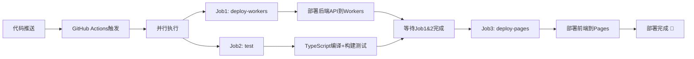

# AI聊天工具技术架构全景图
> 从实际代码出发，深入理解每个技术组件的作用和价值


## 🎯 项目整体架构

### 核心设计理念

这个AI聊天工具是一个**"云原生"**和**"无服务器"(Serverless)**的现代化全栈应用，核心设计理念是**前后端分离**，使得前端和后端可以独立开发、独立部署和独立扩展。

```
👤 用户交互 → 🌐 Cloudflare Pages → ⚛️ React应用 → ⚡ Cloudflare Workers → 🤖 DeepSeek AI
     ↓              ↓                ↓               ↓                 ↓
  全球快速访问    静态资源托管      组件化UI界面    边缘计算API        智能对话能力
```

**四大核心组成部分**：
- **前端 (Frontend)** - React + TypeScript构建的响应式界面，托管在Cloudflare Pages
- **后端 (Backend)** - Cloudflare Workers驱动的无服务器API，运行在全球边缘节点
- **AI核心 (AI Core)** - DeepSeek AI模型提供智能对话能力
- **自动化运维 (DevOps)** - GitHub Actions实现完整的CI/CD流水线

## 📋 核心技术栈详解

基于实际代码文件，以下是项目中每个关键技术及其具体作用：

| 技术 | 作用 | 项目中的具体实现 | 关键文件 |
|:---|:---|:---|:---|
| **React** | 构建用户界面 | 基于组件的UI架构，实现聊天界面的交互逻辑 | `App.tsx`, `MessageList.tsx`, `ChatMessage.tsx`, `MessageInput.tsx` |
| **TypeScript** | 类型安全保障 | 为JavaScript添加静态类型检查，定义数据结构和API接口 | `src/types/index.ts`, 所有`.tsx`文件 |
| **Cloudflare Workers** | 后端API服务 | 无服务器边缘计算平台，处理所有后端逻辑 | `worker.js` |
| **GraphQL** | 前后端通信 | 类型安全的API查询语言，主要通信方式 | `src/services/graphqlClient.ts`, `worker.js`中的GraphQL处理 |
| **REST API** | 备用通信方式 | 传统HTTP API，作为GraphQL的降级方案 | `worker.js`中的`/api/chat`端点 |
| **DeepSeek AI** | 核心AI能力 | 提供智能对话和自然语言处理能力 | `worker.js`中的`callDeepSeekAPI`函数 |
| **Vite** | 前端构建工具 | 极速开发服务器和生产环境打包优化 | `vite.config.ts` |
| **GitHub Actions** | CI/CD自动化 | 自动化测试、构建和部署流程 | `.github/workflows/deploy.yml` |
| **Wrangler** | Cloudflare开发工具 | Worker的配置、开发和部署管理 | `wrangler.toml` |
| **React Markdown** | 富文本渲染 | 将AI返回的Markdown内容渲染为富文本 | `ChatMessage.tsx`中的`ReactMarkdown`组件 |

---

## 🔄 完整业务流程解析

### 一次完整的用户交互流程

让我们跟随一条用户消息，看看它在系统中是如何流转的：

```
👤 用户在输入框输入消息
    ↓
📝 MessageInput.tsx - 处理用户输入，调用sendMessage
    ↓  
🎣 useChat.tsx - 状态管理Hook，更新UI为"发送中"状态
    ↓
🔄 graphqlClient.ts - 构造GraphQL查询，发送到后端
    ↓
⚡ worker.js - Cloudflare Worker接收并处理GraphQL请求
    ↓
🤖 DeepSeek API - AI模型根据对话历史生成回答
    ↓
📤 worker.js - 格式化AI响应，返回给前端
    ↓
🔄 graphqlClient.ts - 接收响应数据
    ↓
🎣 useChat.tsx - 更新状态，添加AI回答到消息列表
    ↓
📱 MessageList.tsx → ChatMessage.tsx - React重新渲染，显示新消息
    ↓
🎨 ReactMarkdown - 将AI回答渲染为富文本格式
```

### 关键代码文件的具体作用

#### 🎯 前端核心文件

**`src/App.tsx`** - 应用主入口
```typescript
// 应用的根组件，整合所有功能模块
export default function App() {
  return (
    <ChatProvider>      // 提供全局状态管理
      <div className="app">
        <Header />       // 应用头部
        <MessageList />  // 消息列表
        <MessageInput /> // 输入框
      </div>
    </ChatProvider>
  );
}
```

**`src/hooks/useChat.tsx`** - 状态管理核心
```typescript
// 这是整个应用的"大脑"，管理所有聊天相关的状态
- 消息列表管理 (messages)
- 加载状态控制 (loading)  
- 错误处理 (lastError)
- 连接状态监控 (connectionStatus)
- 核心业务逻辑 (sendMessage函数)
```

**`src/services/graphqlClient.ts`** - API通信层
```typescript
// 自定义GraphQL客户端，负责与后端通信
- 环境自适应 (自动检测开发/生产环境)
- 重试机制 (3次重试，指数退避)
- 错误处理 (网络错误、API错误分类)
- REST降级 (GraphQL失败时的备用方案)
```

#### ⚡ 后端核心文件

**`worker.js`** - 后端全部逻辑
```javascript
// 这个文件就是整个后端，包含：
export default {
  async fetch(request, env, ctx) {
    // 1. 路由分发 - 处理不同的API端点
    // 2. 请求验证 - 确保请求格式正确
    // 3. GraphQL处理 - 解析GraphQL查询
    // 4. AI API调用 - 安全地调用DeepSeek
    // 5. 响应格式化 - 标准化返回格式
    // 6. 错误处理 - 统一的错误响应
  }
}
```

#### 🚀 部署配置文件

**`.github/workflows/deploy.yml`** - CI/CD流水线
```yaml
# 定义了三个并行/串行的任务：
jobs:
  deploy-workers:    # 部署后端API
  test:             # 构建测试  
  deploy-pages:     # 部署前端(等待前两个完成)
```

**`wrangler.toml`** - Worker配置
```toml
# Cloudflare Worker的配置文件
name = "ai-chat-api"           # Worker名称
main = "worker.js"             # 入口文件
compatibility_date = "2024-01-01"  # 运行时版本

# 生产环境路由规则
[[env.production.routes]]
pattern = "bestvip.life/api/*"    # 处理API请求
pattern = "bestvip.life/graphql"   # 处理GraphQL请求
```

---

## 🎯 技术选型的智慧

### 为什么选择这些技术？

#### ⚛️ **React + TypeScript**
- **组件化开发** - 代码复用性高，维护性强
- **类型安全** - 编译时发现错误，减少bug
- **生态丰富** - 海量第三方库和工具支持
- **学习成本** - 主流技术，人才储备充足

#### ⚡ **Cloudflare Workers**
- **极低延迟** - 边缘计算，用户就近访问
- **零运维** - 无需管理服务器，自动扩缩容
- **成本优势** - 按需付费，免费额度慷慨
- **全球分布** - 300+节点，天然高可用

#### 🔄 **GraphQL + REST双模式**
- **GraphQL优势** - 类型安全，按需获取，单一端点
- **REST备用** - 兼容性好，调试简单，降级方案
- **智能切换** - 自动重试和降级，提升可用性

#### 🤖 **DeepSeek AI**
- **模型质量** - 高质量的中文对话能力
- **API稳定** - 可靠的服务可用性
- **成本效益** - 合理的调用价格
- **集成便利** - 标准REST API，易于集成

---

## 🔧 项目关键配置文件解析

### `package.json` - 项目依赖管理
```json
{
  "scripts": {
    "dev": "vite",                    // 启动开发服务器
    "build": "tsc && vite build",     // TypeScript编译 + 打包
    "preview": "vite preview"         // 预览构建结果
  },
  "dependencies": {
    "react": "^18.3.1",              // React核心库
    "react-dom": "^18.3.1",          // React DOM操作
    "react-markdown": "^9.0.1",      // Markdown渲染
    "remark-gfm": "^4.0.0"          // GitHub风格Markdown
  }
}
```

### `vite.config.ts` - 构建配置优化
```typescript
export default defineConfig({
  plugins: [react()],
  build: {
    rollupOptions: {
      output: {
        manualChunks: {
          vendor: ['react', 'react-dom'],           // 第三方库单独打包
          markdown: ['react-markdown', 'remark-gfm'] // Markdown相关库分离
        }
      }
    }
  },
  server: {
    proxy: {
      '/api': {
        target: 'http://localhost:8787',  // 本地开发时代理到Worker
        changeOrigin: true
      }
    }
  }
})
```

### `tsconfig.json` - TypeScript配置
```json
{
  "compilerOptions": {
    "strict": true,           // 启用所有严格类型检查
    "target": "ES2020",       // 编译目标
    "module": "ESNext",       // 模块系统
    "moduleResolution": "node" // 模块解析策略
  }
}
```

---

## 🚀 自动化部署流程详解

### GitHub Actions工作流程

当你推送代码到`main`分支时，会自动触发以下流程：



### 部署时间统计
- **总耗时**: 3-5分钟
- **Workers部署**: ~1分钟  
- **构建测试**: ~1分钟
- **Pages部署**: ~2分钟

---

## 💡 开发实践建议

### 本地开发环境搭建

```bash
# 1. 克隆项目
git clone https://github.com/593496637/ai-chat-tool.git
cd ai-chat-tool

# 2. 安装依赖
npm install

# 3. 启动前端开发服务器
npm run dev

# 4. 另开终端，启动Worker开发服务器
wrangler dev
```

### 常用开发命令

```bash
# 前端相关
npm run dev          # 启动开发服务器(热更新)
npm run build        # 生产环境构建
npm run preview      # 预览构建结果

# 后端相关  
wrangler dev         # 本地Worker开发
wrangler deploy      # 手动部署Worker
wrangler tail        # 查看Worker实时日志

# 代码质量
npm run type-check   # TypeScript类型检查
```

### 调试技巧

**前端调试**：
```javascript
// 在useChat.tsx中添加日志
console.log('发送消息:', messageContent);
console.log('当前状态:', state);

// 使用React DevTools查看组件状态
// 在浏览器Network面板查看API请求
```

**后端调试**：
```javascript
// 在worker.js中添加日志
console.log('=== 新请求 ===');
console.log('请求路径:', pathname);
console.log('请求方法:', method);
```

---

## 🔍 常见问题排查

### 1. 前端无法连接后端
**现象**: 控制台显示网络错误
**排查步骤**:
```bash
# 检查Worker是否正常运行
curl https://bestvip.life/health

# 检查本地环境
curl http://localhost:8787/health

# 查看浏览器Network面板的请求详情
```

### 2. AI回复异常
**现象**: 收到错误消息或无回复
**排查步骤**:
```bash
# 检查API密钥是否正确设置
echo $DEEPSEEK_API_KEY

# 查看Worker日志
wrangler tail --env production

# 检查API调用限制和余额
```

### 3. 部署失败
**现象**: GitHub Actions显示部署错误
**排查步骤**:
- 检查GitHub Secrets是否正确配置
- 查看Actions日志的详细错误信息
- 验证Cloudflare Token权限

---

## 🎯 项目扩展方向

### 短期优化 (1-2周)
- **错误重试优化** - 智能重试策略和错误分类
- **UI体验提升** - 加载动画和交互反馈优化
- **性能监控** - 添加关键指标监控

### 中期功能 (1-3个月)
- **用户认证** - 添加登录注册功能
- **对话历史** - 本地存储和云端同步
- **多模型支持** - 集成其他AI模型选择

### 长期发展 (3个月以上)
- **实时对话** - WebSocket支持流式响应
- **多用户协作** - 共享聊天室功能
- **插件系统** - 开放第三方扩展接口

---

## 📚 学习成果总结

通过这个项目，你将掌握：

✅ **现代前端开发** - React + TypeScript + Vite的完整开发流程  
✅ **云原生后端** - Serverless架构和边缘计算的实际应用  
✅ **API设计** - GraphQL和REST的最佳实践  
✅ **自动化运维** - CI/CD流水线的搭建和优化  
✅ **AI集成** - 第三方AI服务的安全集成方案  

### 继续学习建议

1. **深入React生态** - 学习状态管理库(Redux、Zustand)和路由库
2. **扩展Cloudflare技能** - 学习D1数据库、KV存储等其他服务
3. **提升TypeScript** - 掌握高级类型操作和泛型编程
4. **优化性能** - 学习Web性能优化和监控技术
5. **参与开源** - 为相关开源项目贡献代码

---

**🎉 这是一个完整的现代化全栈应用！通过学习这个项目，你已经站在了Web开发技术的前沿。继续实践和探索，成为更优秀的开发者！** 🚀
